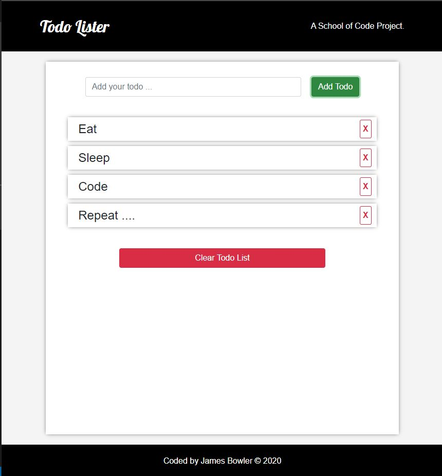

# Simple Todo App

A HTML5 CSS3 & JavaScript todo app project.
Built as a learning exercise during the first few weeks of the School of Code bootcamp.

### To start:

View live [here](https://todoapp-jb.netlify.app/)

Alternative:

1. Run with live server in VsCode

##### Screenshot:

